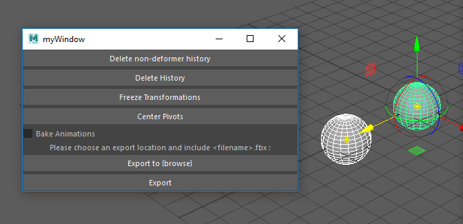

# MayaScript (Maxart)
A custom Maya Python script made for Maxart to assist with FBX exporting/streamlining.

While interning at Maxart, myself and 1 other intern from Coder Academy, Jeb, were asked to assist with streamlining the FBX exporting process within Maya.

Some of the implemented features include the ability to:
- Center pivots
- Delete non-deformers
- Freeze transformations
- Delete history
- Export with or without baking animation

